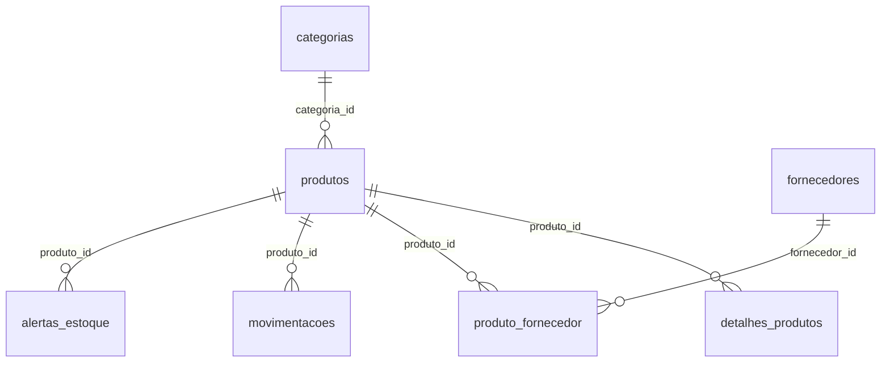

# Documentação Técnica do Banco de Dados SuperBompreco

**Versão:** 1.0

## 1. Introdução

Este documento tem como objetivo apresentar a especificação técnica do banco de dados `SuperBompreco`, desenvolvido para gerenciar as operações de estoque de um supermercado. Ele detalha a estrutura do modelo de dados, as entidades envolvidas, seus atributos, relacionamentos, e a lógica de negócio implementada através de triggers para garantir a integridade e a automação do sistema de estoque.

## 2. Visão Geral do Sistema

O sistema `SuperBompreco` é uma solução de gerenciamento de estoque que visa otimizar o controle de produtos, fornecedores, categorias, movimentações de entrada e saída, e a geração de alertas para níveis críticos de estoque. A arquitetura do banco de dados foi projetada para ser robusta e escalável, suportando as necessidades operacionais de um supermercado.

## 3. Modelo de Dados (Diagrama de Entidade-Relacionamento - ERD)

O diagrama de Entidade-Relacionamento (ERD) a seguir ilustra a estrutura lógica do banco de dados `SuperBompreco`, destacando as entidades (tabelas) e os relacionamentos entre elas.



## 4. Dicionário de Dados

Esta seção descreve detalhadamente cada tabela, seus atributos (colunas), tipos de dados, restrições e uma breve descrição de sua finalidade.

### 4.1. Tabela `categorias`

**Propósito:** Armazenar as diferentes categorias às quais os produtos pertencem.

| Nome do Campo | Tipo de Dados | Restrições | Descrição |
| --- | --- | --- | --- |
| `id` | `INT` | `PRIMARY KEY`, `AUTO_INCREMENT`, `NOT NULL` | Identificador único e sequencial da categoria. |
| `nome` | `VARCHAR(100)` | `NOT NULL` | Nome descritivo da categoria do produto (ex: 'Mercearia Básica', 'Limpeza'). |

### 4.2. Tabela `fornecedores`

**Propósito:** Registrar informações sobre os fornecedores que abastecem o supermercado.

| Nome do Campo | Tipo de Dados | Restrições | Descrição |
| --- | --- | --- | --- |
| `id` | `INT` | `PRIMARY KEY`, `AUTO_INCREMENT`, `NOT NULL` | Identificador único e sequencial do fornecedor. |
| `razao_social` | `VARCHAR(150)` | `NOT NULL` | Nome completo ou razão social do fornecedor. |
| `cnpj` | `VARCHAR(18)` | `UNIQUE`, `NOT NULL` | Cadastro Nacional da Pessoa Jurídica do fornecedor, deve ser único. |

### 4.3. Tabela `produtos`

**Propósito:** Manter os dados essenciais de cada produto disponível no estoque.

| Nome do Campo | Tipo de Dados | Restrições | Descrição |
| --- | --- | --- | --- |
| `id` | `INT` | `PRIMARY KEY`, `AUTO_INCREMENT`, `NOT NULL` | Identificador único e sequencial do produto. |
| `nome` | `VARCHAR(150)` | `NOT NULL` | Nome comercial do produto. |
| `quantidade_atual` | `INT` | `DEFAULT 0`, `NOT NULL` | Quantidade atual do produto em estoque. Inicializa com 0. |
| `capacidade_maxima` | `INT` | `DEFAULT 1000`, `NOT NULL` | Capacidade máxima de armazenamento para este produto no estoque. |
| `categoria_id` | `INT` | `NOT NULL`, `FOREIGN KEY` | Chave estrangeira referenciando `id` da tabela `categorias`. |

### 4.4. Tabela `detalhes_produtos`

**Propósito:** Armazenar informações adicionais e específicas de cada produto, em um relacionamento um-para-um com a tabela `produtos`.

| Nome do Campo | Tipo de Dados | Restrições | Descrição |
| --- | --- | --- | --- |
| `produto_id` | `INT` | `PRIMARY KEY`, `FOREIGN KEY`, `NOT NULL` | Chave primária e estrangeira referenciando `id` da tabela `produtos`. A exclusão de um produto resultará na exclusão em cascata de seus detalhes. |
| `peso_gramas` | `DECIMAL(10,2)` |  | Peso do produto em gramas. |
| `perecivel` | `BOOLEAN` | `NOT NULL`, `DEFAULT FALSE` | Indica se o produto é perecível (`TRUE`) ou não (`FALSE`). |
| `codigo_barras` | `VARCHAR(50)` | `UNIQUE` | Código de barras único para identificação do produto. |

### 4.5. Tabela `produto_fornecedor`

**Propósito:** Gerenciar o relacionamento muitos-para-muitos entre produtos e fornecedores, registrando o preço de custo específico de cada produto por fornecedor.

| Nome do Campo | Tipo de Dados | Restrições | Descrição |
| --- | --- | --- | --- |
| `produto_id` | `INT` | `NOT NULL`, `FOREIGN KEY` | Chave estrangeira referenciando `id` da tabela `produtos`. |
| `fornecedor_id` | `INT` | `NOT NULL`, `FOREIGN KEY` | Chave estrangeira referenciando `id` da tabela `fornecedores`. |
| `preco_custo` | `DECIMAL(10,2)` | `NOT NULL` | Preço de custo do produto quando adquirido deste fornecedor. |
| `PRIMARY KEY` |  | `(produto_id, fornecedor_id)` | Chave primária composta para garantir a unicidade da relação. |

### 4.6. Tabela `movimentacoes`

**Propósito:** Registrar todas as transações de entrada e saída de produtos no estoque, servindo como um histórico.

| Nome do Campo | Tipo de Dados | Restrições | Descrição |
| --- | --- | --- | --- |
| `id` | `INT` | `PRIMARY KEY`, `AUTO_INCREMENT`, `NOT NULL` | Identificador único e sequencial da movimentação. |
| `produto_id` | `INT` | `NOT NULL`, `FOREIGN KEY` | Chave estrangeira referenciando `id` da tabela `produtos`. |
| `tipo` | `ENUM(\'Entrada\', \'Saída\')` | `NOT NULL` | Indica se a movimentação é de 'Entrada' (reposição) ou 'Saída' (venda/consumo). |
| `quantidade` | `INT` | `NOT NULL` | Quantidade de unidades do produto envolvidas na movimentação. |
| `data_movimentacao` | `DATETIME` | `DEFAULT CURRENT_TIMESTAMP`, `NOT NULL` | Carimbo de data/hora da ocorrência da movimentação. |

### 4.7. Tabela `alertas_estoque`

**Propósito:** Armazenar registros de alertas gerados automaticamente quando o nível de estoque de um produto atinge um patamar crítico.

| Nome do Campo | Tipo de Dados | Restrições | Descrição |
| --- | --- | --- | --- |
| `id` | `INT` | `PRIMARY KEY`, `AUTO_INCREMENT`, `NOT NULL` | Identificador único e sequencial do alerta. |
| `produto_id` | `INT` | `NOT NULL`, `FOREIGN KEY` | Chave estrangeira referenciando `id` da tabela `produtos`. |
| `mensagem` | `VARCHAR(255)` | `NOT NULL` | Descrição detalhada do alerta (ex: |

'ATENÇÃO: Produto atingiu nível crítico. Restam apenas X unidades.'). || `data_alerta` | `DATETIME` | `DEFAULT CURRENT_TIMESTAMP`, `NOT NULL` | Carimbo de data/hora em que o alerta foi gerado. || `status` | `ENUM(\'Pendente\', \'resolvido\')` | `DEFAULT \'Pendente\'`, `NOT NULL` | Status atual do alerta, indicando se foi tratado ou não. |

## 5. Lógica de Negócio Implementada (Triggers)

### 5.1. Trigger `trg_gerencia_estoque_completo`

**Evento:** `BEFORE INSERT ON movimentacoes`

**Descrição:** Esta trigger é fundamental para a automação e integridade do sistema de estoque. Ela intercepta todas as tentativas de inserção na tabela `movimentacoes` e aplica as seguintes regras de negócio:

- **Validação de Entrada (Fronteira Superior):**
  - Antes de registrar uma `ENTRADA`, a trigger calcula a nova quantidade total do produto (`quantidade_atual` + `quantidade` da nova movimentação).
  - Se a `nova_quantidade` exceder a `capacidade_maxima` definida para o produto, a inserção é abortada, e um erro (`SIGNAL SQLSTATE '45000'`) é retornado com a mensagem: `'Operação cancelada: A entrada informada ultrapassa a capacidade máxima deste produto no estoque.'`.
  - Caso contrário, a `quantidade_atual` do produto na tabela `produtos` é atualizada.

- **Validação de Saída (Fronteira Inferior e Não Negatividade):**
  - Antes de registrar uma `SAÍDA`, a trigger verifica se a `quantidade` a ser retirada é maior que a `quantidade_atual` disponível.
  - Se for, a inserção é abortada, e um erro (`SIGNAL SQLSTATE '45000'`) é retornado com a mensagem: `'Operação cancelada: Estoque insuficiente para realizar esta saída.'`.
  - Se houver estoque suficiente, a `quantidade_atual` do produto na tabela `produtos` é atualizada, subtraindo a quantidade da movimentação.
  - **Geração de Alerta de Nível Crítico:** Após a atualização da `quantidade_atual` para uma `SAÍDA`, a trigger calcula 10% da `capacidade_maxima` do produto. Se a `nova_quantidade` for menor ou igual a este limite, e **não houver um alerta ****`PENDENTE`** já existente para este `produto_id` na tabela `alertas_estoque`, um novo alerta é inserido com uma mensagem informativa.

## 6. Consultas SQL Essenciais

Esta seção apresenta exemplos de consultas SQL que podem ser utilizadas para extrair informações relevantes do banco de dados.

- **Listar Produtos e Níveis de Estoque:**

   ```sql
   SELECT nome, quantidade_atual, capacidade_maxima 
   FROM produtos;
   ```

- **Identificar Produtos com Estoque Crítico (Zerado):**

   ```sql
   SELECT nome, quantidade_atual 
   FROM produtos 
   WHERE quantidade_atual = 0;
   ```

- **Visualizar Fornecedores Cadastrados:**

   ```sql
   SELECT razao_social, cnpj 
   FROM fornecedores 
   ORDER BY razao_social ASC;
   ```

- **Obter Detalhes Completos do Produto (incluindo Código de Barras e Perecibilidade):**

   ```sql
   SELECT p.nome, dp.codigo_barras, dp.perecivel 
   FROM produtos p
   INNER JOIN detalhes_produtos dp ON p.id = dp.produto_id;
   ```

- **Consultar Preço de Custo de Produtos por Fornecedor:**

   ```sql
   SELECT p.nome AS Produto, f.razao_social AS Fornecedor, pf.preco_custo AS Preco_Custo
   FROM produtos p
   INNER JOIN produto_fornecedor pf ON p.id = pf.produto_id
   INNER JOIN fornecedores f ON pf.fornecedor_id = f.id;
   ```

- **Calcular Volume Total de Itens em Estoque:**

   ```sql
   SELECT SUM(quantidade_atual) AS volume_total_estoque 
   FROM produtos;
   ```

- **Contagem de Produtos por Categoria:**

   ```sql
   SELECT c.nome AS Categoria, COUNT(p.id) AS total_produtos_cadastrados
   FROM categorias c
   LEFT JOIN produtos p ON c.id = p.categoria_id
   GROUP BY c.nome;
   ```

- **Produtos com Capacidade Acima da Média do Estoque:**

   ```sql
   SELECT nome, capacidade_maxima 
   FROM produtos 
   WHERE capacidade_maxima > (SELECT AVG(capacidade_maxima) FROM produtos);
   ```

- **Análise de Ocupação Percentual do Estoque por Produto:**

   ```sql
   SELECT nome, 
          quantidade_atual, 
          capacidade_maxima, 
          ROUND((quantidade_atual / capacidade_maxima) * 100, 2) AS percentual_ocupacao_estoque
   FROM produtos;
   ```

- **Filtrar Produtos de uma Categoria Específica com Detalhes de Fornecimento:**

   ```sql
   SELECT 
       p.nome, 
       c.nome AS Categoria, 
       f.razao_social, 
       pf.preco_custo 
   FROM produtos p 
   JOIN categorias c 
       ON p.categoria_id = c.id 
   JOIN produto_fornecedor pf 
       ON p.id = pf.produto_id 
   JOIN fornecedores f 
       ON pf.fornecedor_id = f.id 
   WHERE c.nome = 'Mercearia Básica';
   ```

- **Somar Quantidade Total de Itens por Categoria:**

   ```sql
   SELECT 
       c.nome, 
       SUM(p.quantidade_atual) AS total_itens 
   FROM categorias c 
   JOIN produtos p 
       ON c.id = p.categoria_id 
   GROUP BY c.nome;
   ```

- **Consultar Movimentações de Saída com Quantidade Elevada:**

   ```sql
   SELECT * FROM movimentacoes 
   WHERE tipo = 'SAIDA' AND quantidade > 100;
   ```

## 7. Considerações Finais

Este documento serve como um guia abrangente para a compreensão e manutenção do banco de dados `SuperBompreco`. A implementação de triggers e a estrutura relacional garantem um controle de estoque eficiente e a integridade dos dados. Recomenda-se a revisão periódica deste documento e do esquema do banco de dados para garantir sua adequação às necessidades de negócio em constante evolução.

